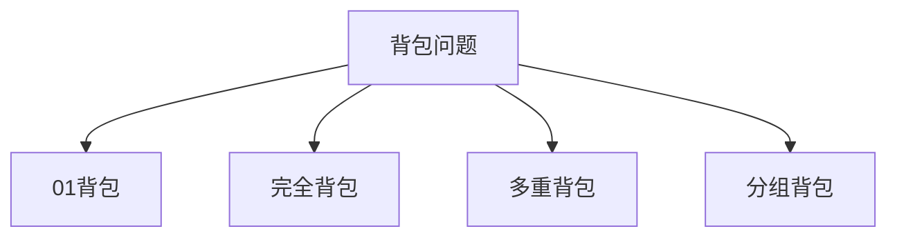

# **背包问题**

##  01背包问题
首先什么是01背包？
**简述**：有一个背包体积为`V(最大的容量)`，现在有几个物品，每个物品的体积为`v[i]`价值为`w[i]`（**每个物品只有一个**），**不超过背包的容量情况下**，背包所背的**价值最大**
<hr>

### 分类讨论：
**某一个状态下是否将某一个物品放到背包里面**
 1.将**第i个物品放进去**，需要满足的条件是`当前物品的体积<背包的剩余的容量`
 ====> **从前`i-1`个物品里面选，背包的剩余容量为`j-v[i]`的最大价值**--------`对应的代码:dp[i][j]=max(dp[i-1][j],dp[i-1][j-v[i]]+w[i]);`
 2.第i个物品不放进背包里面 ===> **从前`i-1`个物品里面选，背包的剩余体积为j的最大价值**--------`对应的代码:dp[i][j]=dp[i-1][j];`
 <hr>

### 优化成一维--滚动数组（只需要最后的结果）
首先观察二维的代码

我们可以发现每一个状态`i`都是由状态`i-1`更新得到的，那么我们是不是就是可以直接不管这个`i`---也就是将数组定义成一维的`dp[j]` 

关于为什么使用逆序而不是正序的解释：


```language
for(int i = 1; i <= n; i++)
{
    for(int j = m; j >= v[i]; j--)  
        dp[j] = max(dp[j], dp[j - v[i]] + w[i]);
} 
```
 <hr>

##  完全背包
**简述**：在**01背包**的基础上唯一发生变化的就是**每一个物品的数量不再是只有一个，而是无限个**
<hr>

### **朴素版：**
对应的代码和01背包也差不多（就是加一个循环---**每一个物品取多少个**）：
```language
for(ll k=0;k*v[i]<=j;k++)
{
   dp[i][j]=max(dp[i][j],dp[i-1][j-k*v[i]]+k*w[i]);
    //k==0时就是不取i的情况
}
```
<hr>

### **优化版--对比法**
将上述循环转化一下==>
`dp[i][j]=max(dp[i-1][j],dp[i-1][j-v]+w,dp[i-1][j-2v]+2w......dp[i-1][j-k*v]+k*w);`
其中的`k`表示的是当剩余体积为`j`时背包所能选当前物品的最大数量，即`j/v[i]`的最大值
又因为`dp[i][j-v]=max(dp[i-1][j-v],dp[i-1][j-2v]+w,.....dp[i-1][j-v-(k-1)*v]+(k-1)*w);`
二者进行相互对比：

就可以将代码优化成：
```language
dp[i][j]=dp[i-1][j];
if(j>=v[i])
{
   dp[i][j]=max(dp[i-1][j],dp[i][j-v[i]]+w[i]);
}
```
<hr>

### **优化版--滚动数组(正序)**

```language
for (int j = v[i]; j <= m; j ++ )
    dp[j] = max(dp[j], dp[j - v[i]] + w[i]);
```


## 多重背包
**简述**：在**完全背包**的基础上唯一发生变化的就是**每一个物品的数量不再是无限个，而是有限个（由题目提供）**
<hr>

### **朴素版**
只需要在完全背包循环的基础上加一个**限制条件**---**没有超过该物品的数量**
```language
for (int k = 0; k <= s[i] && k * v[i] <= j; k ++ )
    dp[i][j] = max(dp[i][j], dp[i - 1][j - v[i] * k] + w[i] * k);
```
其中`s[i]表示物品的最大数量`
<hr>

### **优化版--二进制**
就是将每一个物品的数量**采用二进制进行划分**（因为二进制可以表示所有的数）成多个组，**每一组的数量为1,2,4,8,...,2^k^,其中k是满足2^k^<=s的最大值**，多出来的数单独作为一组

分完组后可以**通过组合实现原本该物品任意的数量----转换成了01背包的问题**
对物品进行分组的代码：
```language
  for(ll i=1;i<=n;i++)//分组--转换成01背包问题
    {
        ll a,b,s;
        cin>>a>>b>>s;
        ll k=1;
        while(k<=s)
        {
            cnt++;
            v[cnt]=a*k;
            w[cnt]=b*k;
            s-=k;
            k<<=1;
        } 
        if(s>0)//多出来的数
        {
            cnt++;
            v[cnt]=a*s;
            w[cnt]=b*s;
        }
    }
```
## 分组背包
**简述**：有n组物品（水果），**每一组里面有s类物品（苹果，香蕉等）**,每一组里面**最多只能选一个（苹果或者香蕉）**，求最大的价值
<hr>

### 朴素版


```language
  for(ll i=1;i<=n;i++)
    {
        for(ll j=1;j<=m;j++)
        {
            dp[i][j]=dp[i-1][j];
            for(ll k=1;k<=s[i];k++)
            {
                if(v[i][k]<=j)
                dp[i][j]=max(dp[i][j],dp[i-1][j-v[i][k]]+w[i][k]);
            }
        }
    }
```
### 优化版--滚动数组
```language
  for(ll i=1;i<=n;i++)
    {
        for(ll j=m;j>=1;j--)
        {
            for(ll k=1;k<=s[i];k++)
            {
                if(v[i][k]<=j)//一维也需要判断能不能放进去
                dp[j]=max(dp[j],dp[j-v[i][k]]+w[i][k]);
            }
        }
    }
```